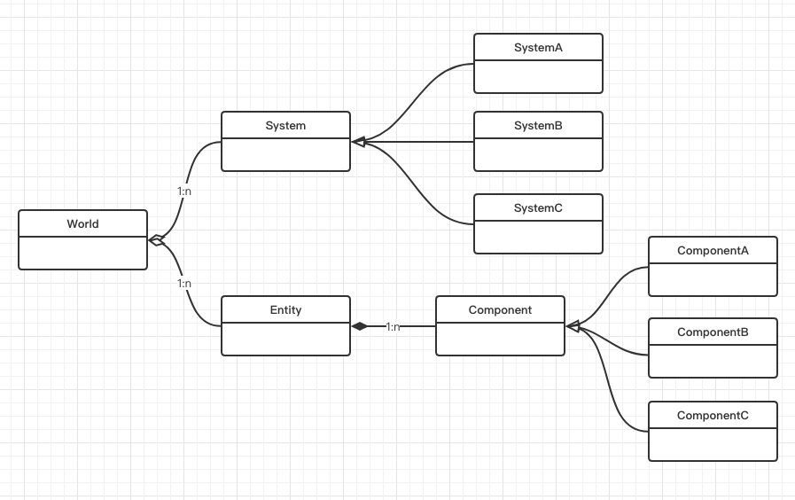

# godot-ecs
Lightweight ecs framework written with gdscript.



# Features

- Lightweight and high-performance.
- Components support serialization and deserialization.
- Easy to use.

# How To Use

- Copy the 'ecs' directory to any location within your Godot project.
- Begin your ECS coding journey with the following code:

```gdscript

# create ecs world
var world := ECSWorld.new()

# create entity
var e: ECSEntity = world.create_entity()

# add component
e.add_component("c1", ECSComponent.new())
e.add_component("c2", ECSComponent.new())
e.add_component("c3", ECSComponent.new())

# add system
world.add_system("s1", ECSSystem.new())
world.add_system("s2", ECSSystem.new())
world.add_system("s3", ECSSystem.new())

# add command
world.add_command("my_command", ECSCommand)

# send notification
world.notify("my_notification", with_param)
world.notify("my_command", with_param)

# view components
for c: ECSComponent in world.view("c1"):
	print(c)

# multi view components
for dict: Dictionary[String, ECSComponent] in world.multi_view(["c1", "c2", "c3"])
	print(dict)

# view components with filter
for c: ECSComponent in world.view("c1", func(c: ECSComponent) -> bool:
	return true):
	print(c)

# multi view components with filter
for dict: Dictionary[String, ECSComponent] in world.multi_view(["c1", "c2"], func(dict: Dictionary[String, ECSComponent]) -> bool:
	return true):
	print(dict)
	
# serialize components
var serialize_dict := {} as Dictionary[int, Dictionary]
for c: ECSComponent in component_list:
	var e: ECSEntity = c.entity()
	var all_components: Array[ECSComponent] = e.get_components()
	var entity_data := {} as Dictionary[String, Dictionary]
	for cc: ECSComponent in all_components:
		var data := {} as Dictionary[StringName, Variant]
		cc.save( data )
		entity_data[ cc.name() ] = data
	var entity_id: int = e.id()
	serialize_dict[ entity_id ] = entity_data

printt("this is entity serialize data", serialize_dict)

```
